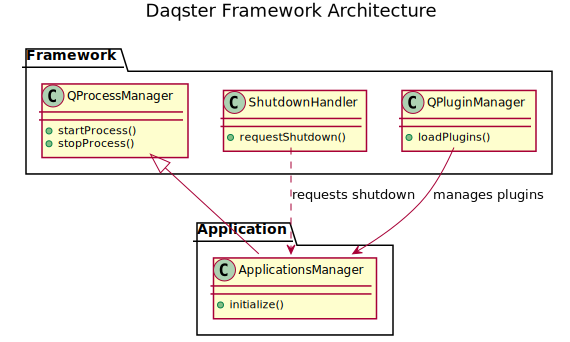
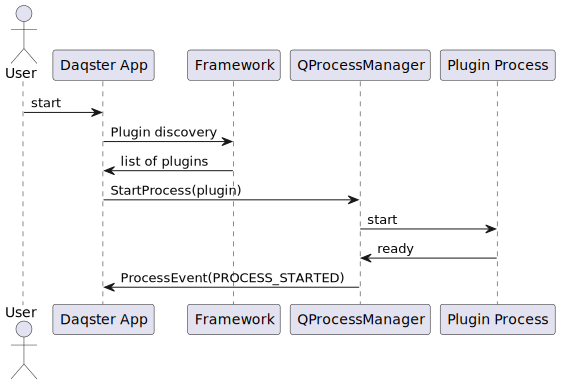

# Architecture Overview

This document provides high-level architecture diagrams and explanations for
the Daqster framework and host application.

See also: [Framework API Reference](./FrameworkAPI.md) and [Developer Guide](./DeveloperGuide.md).

## High-level components

- `frame_work` — core reusable components
  - `platform/` — ShutdownHandler and platform abstractions
  - `process/` — QProcessManager and process utilities
  - `include/` — plugin interfaces and helpers
- `apps/Daqster` — host application built on top of the framework
- `plugins` — plugin modules loaded by the host

## Diagrams

The `Docs/diagrams/` directory contains PlantUML sources and generated SVGs.

### Component diagram

### Sequence: Startup → Plugin Discovery → Launch plugin process

## Notes

- The diagrams are pre-rendered by the CI workflow (when available) but
  the PlantUML sources are kept in the `Docs/diagrams/` folder for easy
  editing and re-generation.
