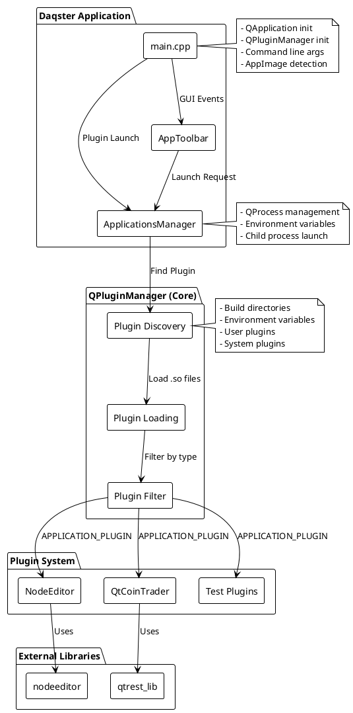
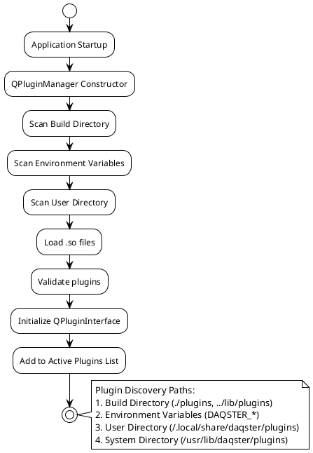
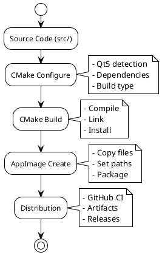
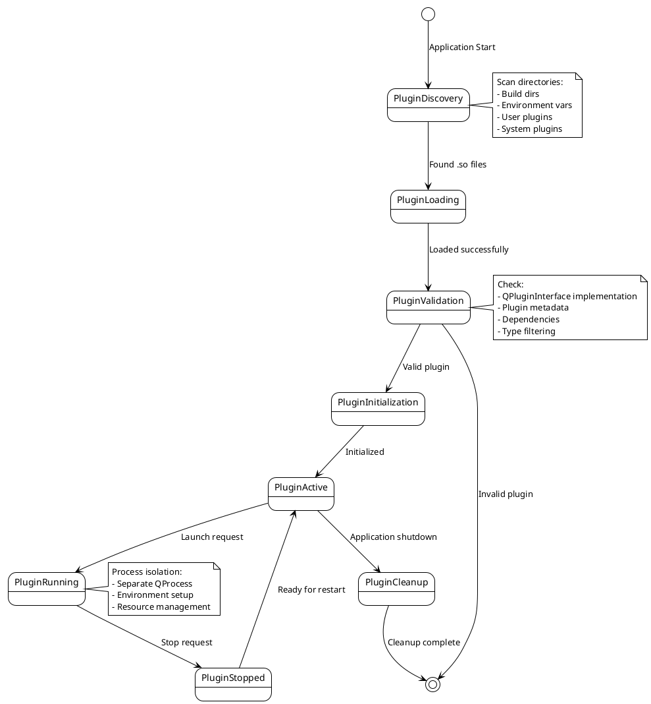

# Архитектура на Daqster

[Български](./Architecture.md) | [English](./Architecture.en.md)

## Общ преглед

Daqster е Qt5-базирана рамка за създаване и зареждане на плъгини с хост приложение. Проектът използва модулна архитектура, която позволява лесно разширяване чрез динамично зареждане на плъгини.

## Структура на проекта

```
Daqster/
├── src/                          # Source код
│   ├── frame_work/               # Ядро на рамката
│   │   └── base/                 # Основни класове
│   │       ├── src/              # Implementation
│   │       └── include/          # Headers
│   ├── apps/                     # Приложения
│   │   └── Daqster/              # Главно приложение
│   ├── plugins/                  # Плъгини
│   │   ├── NodeEditor/           # Node Editor плъгин
│   │   ├── QtCoinTrader/         # QtCoinTrader плъгин
│   │   └── tests/                # Тестови плъгини
│   └── external_libs/            # Външни библиотеки
│       ├── nodeeditor/           # Node Editor библиотека
│       └── qtrest_lib/           # REST API библиотека
├── tools/                        # Инструменти за билд
│   ├── create_appimage.sh        # AppImage създаване
│   └── Build_AppImage/           # Локални AppImage билдове
├── Docs/                         # Документация
│   ├── Architecture.md           # Тази документация
│   ├── Architecture.en.md        # English версия
│   └── HowToDebugAppImage.md     # Debug ръководство
├── .github/workflows/            # CI/CD
│   ├── ci.yml                    # Continuous Integration
│   └── release.yml               # Release workflow
└── CMakeLists.txt                # Главен CMake файл
```

## Основни компоненти

### 1. Frame Work (Ядро)

**Местоположение:** `src/frame_work/base/`

**Основни класове:**
- `QPluginManager` - Управление на плъгини
- `QPluginInterface` - Базов интерфейс за плъгини
- `QPluginLoaderExt` - Разширено зареждане на плъгини
- `PluginFilter` - Филтриране на плъгини

**Отговорности:**
- Откриване на плъгини в различни директории
- Зареждане и инициализиране на плъгини
- Управление на жизнения цикъл на плъгини
- Филтриране по тип и свойства

### 2. Host Application (Главно приложение)

**Местоположение:** `src/apps/Daqster/`

**Основни класове:**
- `main.cpp` - Точка на влизане
- `ApplicationsManager` - Управление на child приложения
- `AppToolbar` - GUI toolbar за стартиране на плъгини

**Отговорности:**
- Инициализиране на Qt приложението
- Зареждане на плъгини при стартиране
- Стартиране на плъгини като отделни процеси
- Управление на GUI елементи

### 3. Plugin System (Система за плъгини)

**Местоположение:** `src/plugins/`

**Типове плъгини:**
- **APPLICATION_PLUGIN** - Самостоятелни приложения
- **DETECT_BY_TYPE_NAME** - Плъгини с custom тип

**Plugin Discovery:**
1. Build директория (`./plugins`, `../lib/daqster/plugins`)
2. Environment variables (`DAQSTER_PLUGIN_DIR`, `DAQSTER_PLUGIN_PATH`)
3. User plugins (`~/.local/share/daqster/plugins`)
4. System plugins (`/usr/lib/daqster/plugins`)

### 4. External Libraries (Външни библиотеки)

**Местоположение:** `src/external_libs/`

**Библиотеки:**
- **nodeeditor** - Графичен редактор за нодове
- **qtrest_lib** - REST API клиент

## Архитектурни принципи

### 1. Модулност
- Всеки компонент е независим модул
- Ясно разделение на отговорности
- Лесно тестване и поддръжка

### 2. Разширяемост
- Динамично зареждане на плъгини
- Plugin discovery система
- Поддръжка за различни типове плъгини

### 3. Изолиране
- Плъгини се стартират като отделни процеси
- Environment variables за изолация
- Независими конфигурационни файлове

### 4. Крос-платформеност
- Qt5 за GUI и крос-платформеност
- CMake за build система
- AppImage за Linux разпространение

## Data Flow

### 1. Стартиране на приложението
```
main.cpp
├── Инициализира QApplication
├── Създава QPluginManager
├── Зарежда плъгини
└── Стартира GUI
```

### 2. Зареждане на плъгини
```
QPluginManager
├── Сканира директории за плъгини
├── Зарежда .so файлове
├── Инициализира QPluginInterface
└── Добавя в списък с активни плъгини
```

### 3. Стартиране на плъгин
```
AppToolbar/ApplicationsManager
├── Получава заявка за стартиране
├── Намира плъгин по име
├── Създава QProcess с environment
└── Стартира като child процес
```

## Архитектурна диаграма


```plantuml
@startuml
!theme plain
skinparam backgroundColor #FFFFFF
skinparam componentStyle rectangle

package "Daqster Application" {
    component [main.cpp] as Main
    component [AppToolbar] as Toolbar
    component [ApplicationsManager] as AppMgr
}

package "QPluginManager (Core)" {
    component [Plugin Discovery] as Discovery
    component [Plugin Loading] as Loading
    component [Plugin Filter] as Filter
}

package "Plugin System" {
    component [NodeEditor] as NodeEditor
    component [QtCoinTrader] as CoinTrader
    component [Test Plugins] as TestPlugins
}

package "External Libraries" {
    component [nodeeditor] as NodeLib
    component [qtrest_lib] as RestLib
}

Main --> Toolbar : GUI Events
Main --> AppMgr : Plugin Launch
Toolbar --> AppMgr : Launch Request
AppMgr --> Discovery : Find Plugin
Discovery --> Loading : Load .so files
Loading --> Filter : Filter by type
Filter --> NodeEditor : APPLICATION_PLUGIN
Filter --> CoinTrader : APPLICATION_PLUGIN
Filter --> TestPlugins : APPLICATION_PLUGIN
NodeEditor --> NodeLib : Uses
CoinTrader --> RestLib : Uses

note right of Main
  - QApplication init
  - QPluginManager init
  - Command line args
  - AppImage detection
end note

note right of AppMgr
  - QProcess management
  - Environment variables
  - Child process launch
end note

note right of Discovery
  - Build directories
  - Environment variables
  - User plugins
  - System plugins
end note
@enduml
```

## Plugin Discovery Flow


```plantuml
@startuml
!theme plain
skinparam backgroundColor #FFFFFF
skinparam activityStyle rectangle

start
:Application Startup;
:QPluginManager Constructor;
:Scan Build Directory;
:Scan Environment Variables;
:Scan User Directory;
:Load .so files;
:Validate plugins;
:Initialize QPluginInterface;
:Add to Active Plugins List;
stop

note right
  Plugin Discovery Paths:
  1. Build Directory (./plugins, ../lib/plugins)
  2. Environment Variables (DAQSTER_*)
  3. User Directory (~/.local/share/daqster/plugins)
  4. System Directory (/usr/lib/daqster/plugins)
end note
@enduml
```

## Build System Flow


```plantuml
@startuml
!theme plain
skinparam backgroundColor #FFFFFF
skinparam activityStyle rectangle

start
:Source Code (src/);
:CMake Configure;
note right
  - Qt5 detection
  - Dependencies
  - Build type
end note
:CMake Build;
note right
  - Compile
  - Link
  - Install
end note
:AppImage Create;
note right
  - Copy files
  - Set paths
  - Package
end note
:Distribution;
note right
  - GitHub CI
  - Artifacts
  - Releases
end note
stop
@enduml
```

## Build System

### CMake Configuration
- **Minimum version:** 3.16
- **Qt version:** 5.15.2
- **Build types:** Debug, Release
- **Install targets:** bin, lib, plugins

### AppImage Creation
- **Unified script:** `tools/create_appimage.sh`
- **Local mode:** Използва локална Qt инсталация
- **CI mode:** Използва системни Qt библиотеки
- **Output:** `Daqster-x86_64.AppImage`

## Environment Variables

### Plugin Discovery
- `DAQSTER_PLUGIN_DIR` - Една директория за плъгини
- `DAQSTER_PLUGIN_PATH` - Множество директории (разделени с `:`)

### Qt Environment
- `LD_LIBRARY_PATH` - Пътища към споделени библиотеки
- `QML2_IMPORT_PATH` - Пътища към QML модули
- `QT_PLUGIN_PATH` - Пътища към Qt плъгини
- `QT_QPA_PLATFORM_PLUGIN_PATH` - Пътища към platform плъгини

### XDG Directories
- `XDG_CONFIG_HOME` - Конфигурационни файлове
- `XDG_DATA_HOME` - Данни
- `XDG_CACHE_HOME` - Кеш

## Security Considerations

### 1. Plugin Isolation
- Плъгини се стартират като отделни процеси
- Ограничен достъп до системни ресурси
- Environment variables за изолация

### 2. Plugin Validation
- Проверка на plugin metadata
- Валидация на plugin интерфейси
- Hash-based дедупликация

### 3. File System Access
- Ограничен достъп до файловата система
- XDG directories за user data
- Read-only AppImage среда

## Performance Considerations

### 1. Plugin Loading
- Lazy loading на плъгини
- Кеширане на plugin metadata
- Hash-based дедупликация

### 2. Memory Management
- RAII за автоматично управление на паметта
- Smart pointers за shared ресурси
- Правилно освобождаване на Qt обекти

### 3. Process Management
- Ефективно стартиране на child процеси
- Правилно управление на environment variables
- Graceful shutdown на процеси

## Testing Strategy

### 1. Unit Tests
- Тестване на отделни компоненти
- Mock обекти за изолация
- Automated test execution

### 2. Integration Tests
- Тестване на plugin зареждане
- Тестване на plugin стартиране
- End-to-end тестове

### 3. AppImage Tests
- Тестване на AppImage функционалност
- Тестване на environment variables
- Cross-platform compatibility

## 9. Plugin Lifecycle Diagram


```plantuml
@startuml
!theme plain
skinparam backgroundColor #FFFFFF
skinparam stateStyle rectangle

[*] --> PluginDiscovery : Application Start
PluginDiscovery --> PluginLoading : Found .so files
PluginLoading --> PluginValidation : Loaded successfully
PluginValidation --> PluginInitialization : Valid plugin
PluginValidation --> [*] : Invalid plugin
PluginInitialization --> PluginActive : Initialized
PluginActive --> PluginRunning : Launch request
PluginRunning --> PluginStopped : Stop request
PluginStopped --> PluginActive : Ready for restart
PluginActive --> PluginCleanup : Application shutdown
PluginCleanup --> [*] : Cleanup complete

note right of PluginDiscovery
  Scan directories:
  - Build dirs
  - Environment vars
  - User plugins
  - System plugins
end note

note right of PluginValidation
  Check:
  - QPluginInterface implementation
  - Plugin metadata
  - Dependencies
  - Type filtering
end note

note right of PluginRunning
  Process isolation:
  - Separate QProcess
  - Environment setup
  - Resource management
end note
@enduml
```

## 10. AppImage Structure Diagram

```plantuml
@startuml
!theme plain
skinparam backgroundColor #FFFFFF
skinparam packageStyle rectangle

package "Daqster-x86_64.AppImage" {
    package "AppRun" {
        [AppRun Script] as AppRun
    }
    
    package "usr/" {
        package "bin/" {
            [Daqster Executable] as Executable
        }
        
        package "lib/" {
            package "plugins/" {
                [Qt Plugins] as QtPlugins
                [Platform Plugins] as PlatformPlugins
            }
            
            package "qml/" {
                [QML Modules] as QMLModules
            }
            
            package "daqster/plugins/" {
                [Daqster Plugins] as DaqsterPlugins
            }
            
            [Qt Libraries] as QtLibs
            [ICU Libraries] as ICULibs
        }
    }
    
    package "usr/share/" {
        package "applications/" {
            [Desktop File] as DesktopFile
        }
        
        package "icons/" {
            [App Icon] as AppIcon
        }
    }
    
    [daqster.desktop] as DesktopFile2
    [daqster.png] as AppIcon2
}

AppRun --> Executable : Launches
AppRun --> QtLibs : Sets LD_LIBRARY_PATH
AppRun --> QtPlugins : Sets QT_PLUGIN_PATH
AppRun --> QMLModules : Sets QML2_IMPORT_PATH
AppRun --> DaqsterPlugins : Sets DAQSTER_PLUGIN_DIR
Executable --> DaqsterPlugins : Loads plugins
Executable --> QtPlugins : Uses Qt plugins
Executable --> QMLModules : Uses QML modules

note right of AppRun
  Environment Setup:
  - LD_LIBRARY_PATH
  - QT_PLUGIN_PATH
  - QML2_IMPORT_PATH
  - DAQSTER_PLUGIN_DIR
  - XDG directories
end note
@enduml
```

## 11. Future Enhancements

### 1. Plugin Management
- GUI за управление на плъгини
- Plugin marketplace
- Автоматично обновяване на плъгини

### 2. Performance
- Plugin preloading
- Memory optimization
- Startup time improvement

### 3. Security
- Plugin sandboxing
- Code signing
- Permission system

## Заключение

Daqster използва модулна архитектура, която позволява лесно разширяване и поддръжка. Системата за плъгини е проектирана да бъде безопасна, ефективна и лесна за използване. Build системата поддържа както локална разработка, така и CI/CD за автоматизирано разпространение.
