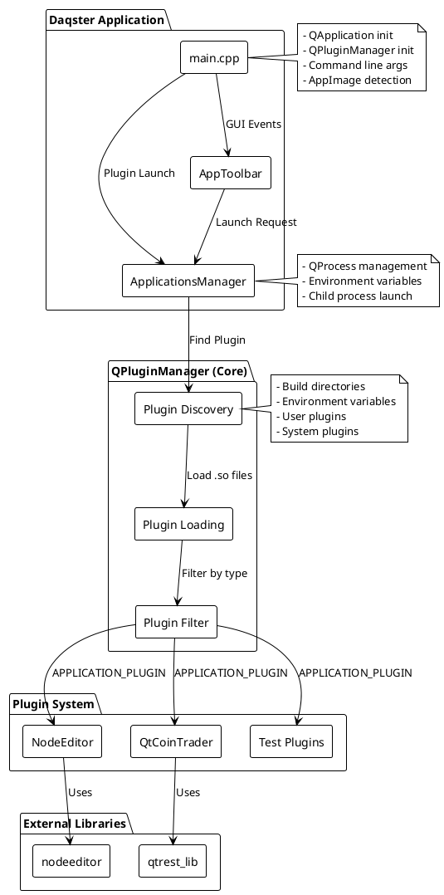
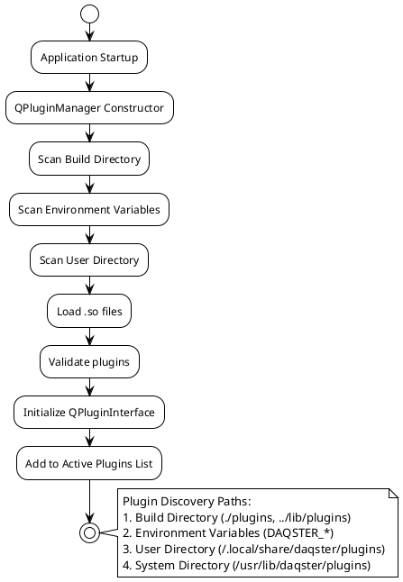
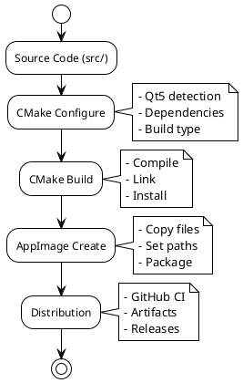
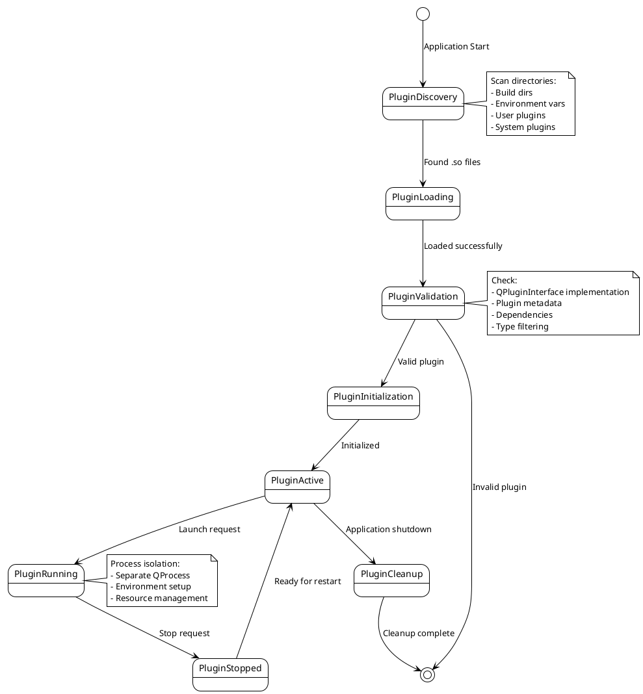

# Daqster Architecture

[Български](./README.md) | [English](./README.en.md)

Parent: [Documentation Index](../INDEX.en.md)

## Architecture Hub

- [BuildSystemArchitecture.en.md](./BuildSystemArchitecture.en.md) - build architecture and dependency model
- [apps/README.md](./apps/README.md) - applications subsystem
- [framework/README.md](./framework/README.md) - framework subsystem
- [plugins/README.md](./plugins/README.md) - plugins subsystem

## Related Sections

- [Development Topics](../development/README.md) - contributor workflow and debugging topics

This document describes the architecture of Daqster, its main components, data flow, and working principles.

## 1. Overview

Daqster is a modular, plugin-based platform developed with Qt5, designed for data acquisition and analysis applications. It provides a flexible framework that allows easy extension through dynamically loaded plugins.

## 2. Main Architectural Components

### 2.1. Frame Work (Core)
This is the heart of Daqster, responsible for plugin management.

*   **`QPluginManager`**:
    *   Discovers and loads plugins from various directories (build, user, system, environment variables).
    *   Manages the lifecycle of plugins (loading, initialization, cleanup).
    *   Uses hash-based deduplication to ensure each plugin is loaded only once.
    *   Provides API for the host application to interact with plugins.
*   **`QPluginInterface`**:
    *   Abstract base class that all plugins must implement.
    *   Defines a standard interface for communication between the host application and plugins.
    *   Includes methods for initialization, starting, stopping, and accessing plugin metadata.
*   **`PluginFilter`**:
    *   Mechanism for filtering plugins based on their type (`APPLICATION_PLUGIN`, `DETECT_BY_TYPE_NAME`) or other metadata.
    *   Allows the host application to load only specific types of plugins.

### 2.2. Host Application (`src/apps/Daqster`)
The main application that provides user interface and manages plugin launching.

*   **`main.cpp`**:
    *   Application entry point.
    *   Initializes `QApplication` and `QPluginManager`.
    *   Handles command-line arguments for direct plugin launching.
    *   Detects whether the application is running as an AppImage and adapts its behavior.
*   **`ApplicationsManager`**:
    *   Responsible for launching plugins as separate processes (`QProcess`).
    *   Properly configures environment variables (`LD_LIBRARY_PATH`, `QT_PLUGIN_PATH`, `DAQSTER_PLUGIN_DIR`, etc.) for each child process, considering whether it's running in AppImage or as a regular build.
    *   Ensures that plugins can find their dependencies and resources.
*   **`AppToolbar`**:
    *   Manages GUI elements such as menus and buttons for launching plugins.
    *   Sends requests to `ApplicationsManager` to launch selected plugins.

### 2.3. Plugin System (`src/plugins`)
Examples of plugins that demonstrate the framework's capabilities.

*   **`NodeEditor`**:
    *   Plugin that provides a graphical interface for creating and editing nodes.
    *   Uses `nodeeditor` external library.
    *   Can work as a standalone application.
*   **`QtCoinTrader`**:
    *   Plugin for cryptocurrency trading, using QML for user interface.
    *   Demonstrates QML and QtCharts integration.
    *   Can work as a standalone application.
*   **Test Plugins (e.g., `plugin_fancy_test`, `plugin_uggly_test`, `template_plugin_daqster`)**:
    *   Simple plugins used for testing `QPluginManager` and `QPluginInterface` functionality.
    *   Show how to implement `QPluginInterface`.

### 2.4. External Libraries (`src/external_libs`)
External libraries integrated into the project.

*   **`nodeeditor`**:
    *   Library for creating graphical node editors.
    *   Used by the `NodeEditor` plugin.
*   **`qtrest_lib`**:
    *   Library for REST API communication.
    *   Can be used by plugins that require HTTP requests.

### 2.5. Tools (`tools/`)
Directory containing scripts and helper files for build and packaging.

*   **`create_appimage.sh`**:
    *   Universal shell script for creating AppImage.
    *   Supports `local` and `ci` modes with different configurations.
    *   Automates the process of copying files, setting environment variables, and packaging.
*   **`Build_AppImage/`**:
    *   Directory used for local AppImage builds. Contains temporary files and the final AppImage.

### 2.6. Docs (`Docs/`)
Directory for documentation.

*   **`development/HowToDebugAppImage.md`**:
    *   Guide for debugging AppImage applications.
*   **`development/DeveloperGuide.md`**:
    *   Contributor workflow and development notes.
*   **`operations/BuildHelpers.en.md`**:
    *   Helper scripts for build and maintenance tasks.
*   **`operations/UpstreamManagement.md`**:
    *   Guide for synchronizing and maintaining upstream dependencies.
*   **`porting/QtRest_Qt6_Porting.md`**:
    *   Notes and decisions related to Qt6 porting of QtRest.
*   **`Architecture/README.en.md`**:
    *   This document.

## 3. Key Architectural Principles

### 1. Modularity and Extensibility
- The core is separated from plugins, allowing easy addition of new functionality without changing the main code.
- Plugins are independent and can be developed and tested separately.

### 2. Dynamic Loading
- Plugins are loaded at runtime, which optimizes application startup time and provides flexibility.

### 3. Process Isolation
- Each plugin is launched as a separate child process, which increases stability and security. A problem in one plugin does not lead to a crash of the entire application.

### 4. Cross-platform
- Qt5 for GUI and cross-platform compatibility
- CMake for build system
- AppImage for Linux distribution

## Data Flow

### 1. Application Startup
```
main.cpp
├── Initialize QApplication
├── Create QPluginManager
├── Load plugins
└── Start GUI
```

### 2. Plugin Loading
```
QPluginManager
├── Scan directories for plugins
├── Load .so files
├── Initialize QPluginInterface
└── Add to active plugins list
```

### 3. Plugin Launch
```
AppToolbar/ApplicationsManager
├── Receive launch request
├── Find plugin by name
├── Create QProcess with environment
└── Launch as child process
```

## Architecture Diagram



## Plugin Discovery Flow



## Build System Flow



## 4. Build System

### CMake Configuration
- **Minimum version:** 3.16
- **Qt5 modules:** Core, Widgets, Gui, QML, QuickControls2, Charts, Network, Multimedia, OpenGL.
- **External dependencies:** `nodeeditor`, `qtrest_lib`.
- **Build types:** Debug (for development) and Release (for production).
- **RPATH:** Configured for automatic finding of shared libraries.

### AppImage Creation
- **Unified script:** `tools/create_appimage.sh` automates the entire process.
- **Self-contained:** All necessary Qt libraries, plugins, and QML modules are copied into the AppImage.
- **Environment variables:** The `AppRun` script in the AppImage sets up `LD_LIBRARY_PATH`, `QT_PLUGIN_PATH`, `QML2_IMPORT_PATH`, `DAQSTER_PLUGIN_DIR`, `DAQSTER_PLUGIN_PATH`, and XDG variables.
- **Debug/Release:** Supports creating both Debug and Release AppImage.

## 5. Environment Variables

### Plugin Discovery
- `DAQSTER_PLUGIN_DIR`: Sets a single directory for searching Daqster plugins.
- `DAQSTER_PLUGIN_PATH`: Sets multiple directories for searching Daqster plugins, separated by `:`.

### Qt Environment (in AppImage)
- `LD_LIBRARY_PATH`: Tells the dynamic linker where to look for shared libraries.
- `QML2_IMPORT_PATH`: Tells the QML engine where to look for QML modules.
- `QT_PLUGIN_PATH`: Tells Qt where to look for its plugins (e.g., image formats, SQL drivers).
- `QT_QPA_PLATFORM_PLUGIN_PATH`: Specifies the path to platform integration plugins (e.g., `libqxcb.so`).

### XDG Directories (for AppImage)
- `XDG_CONFIG_HOME`: Directory for user configuration files (default: `~/.config/daqster`).
- `XDG_DATA_HOME`: Directory for user data (default: `~/.local/share/daqster`).
- `XDG_CACHE_HOME`: Directory for user cache files (default: `~/.cache/daqster`).

### Debug Environment
- `QT_DEBUG_PLUGINS=1`: Enables detailed debug information for Qt plugin loading.
- `QT_LOGGING_RULES="*=true"`: Enables all Qt debug messages.
- `DAQSTER_DEBUG=1`: Enables Daqster-specific debug messages (if implemented).

## 6. Security Considerations

- **Plugin Isolation:** Launching plugins as separate processes provides some isolation, but it's not a complete sandbox environment.
- **Code Signing:** For production environments, consider signing plugins to verify their authenticity.
- **Input Validation:** All data coming from plugins or external sources must be validated.

## 7. Performance Considerations

- **Dynamic Loading:** Plugins are loaded only when needed, which optimizes startup time.
- **Process Overhead:** Launching each plugin as a separate process has a small overhead, but provides stability.
- **Resource Management:** Efficient management of memory and resources in plugins is crucial.

## 8. Testing Strategy

- **Unit Tests:** For individual components and plugin logic.
- **Integration Tests:** For interaction between the host application and plugins.
- **AppImage Tests:** Automated tests for AppImage startup and functionality.
- **Manual Testing:** For GUI and user experience.

## 9. Plugin Lifecycle Diagram



## 10. AppImage Structure Diagram

```plantuml
@startuml
!theme plain
skinparam backgroundColor #FFFFFF
skinparam packageStyle rectangle

package "Daqster-x86_64.AppImage" {
    package "AppRun" {
        [AppRun Script] as AppRun
    }
    
    package "usr/" {
        package "bin/" {
            [Daqster Executable] as Executable
        }
        
        package "lib/" {
            package "plugins/" {
                [Qt Plugins] as QtPlugins
                [Platform Plugins] as PlatformPlugins
            }
            
            package "qml/" {
                [QML Modules] as QMLModules
            }
            
            package "daqster/plugins/" {
                [Daqster Plugins] as DaqsterPlugins
            }
            
            [Qt Libraries] as QtLibs
            [ICU Libraries] as ICULibs
        }
    }
    
    package "usr/share/" {
        package "applications/" {
            [Desktop File] as DesktopFile
        }
        
        package "icons/" {
            [App Icon] as AppIcon
        }
    }
    
    [daqster.desktop] as DesktopFile2
    [daqster.png] as AppIcon2
}

AppRun --> Executable : Launches
AppRun --> QtLibs : Sets LD_LIBRARY_PATH
AppRun --> QtPlugins : Sets QT_PLUGIN_PATH
AppRun --> QMLModules : Sets QML2_IMPORT_PATH
AppRun --> DaqsterPlugins : Sets DAQSTER_PLUGIN_DIR
Executable --> DaqsterPlugins : Loads plugins
Executable --> QtPlugins : Uses Qt plugins
Executable --> QMLModules : Uses QML modules

note right of AppRun
  Environment Setup:
  - LD_LIBRARY_PATH
  - QT_PLUGIN_PATH
  - QML2_IMPORT_PATH
  - DAQSTER_PLUGIN_DIR
  - XDG directories
end note
@enduml
```

## 11. Future Enhancements

- **Plugin Management GUI:** Integrated user interface for managing installed plugins (enable/disable, install/uninstall).
- **Sandbox Environment:** Stricter isolation of plugins (e.g., through Flatpak or Docker).
- **Remote Plugin Loading:** Ability to load plugins from remote sources.
- **Performance Monitoring:** Tools for monitoring plugin performance.
- **Cross-platform AppImages:** Extending AppImage builds for other architectures.