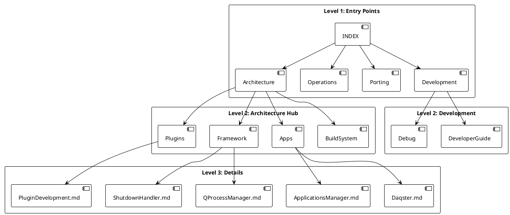

[Български](./INDEX.md) | [English](./INDEX.en.md)

# Documentation Index

This is the main navigation page. Only top-level entry points live here.

## Main Entry Points

- [Project README](../README.en.md) - Project overview, build instructions, structure
- [Architecture](./Architecture/README.en.md) - architecture hub and subsystem navigation
- [Development Topics](./development/README.md) - development workflow and debugging topics
- [Operations Topics](./operations/README.md) - build, maintenance, and operational topics
- [Porting Topics](./porting/README.md) - migration and compatibility topics

## Diagrams

Visual overviews of architecture and processes (PlantUML sources and generated SVGs):

### Architecture

#### Architecture Diagram — overall system architecture

[Source: architecture.puml](./diagrams/architecture.puml)

#### Framework Components — framework layers and classes

[Source: framework_components.puml](./diagrams/framework_components.puml)

#### Applications Manager — application layer

[Source: apps_architecture.puml](./diagrams/apps_architecture.puml)

### Processes

#### Startup Sequence — Daqster initialization

[Source: startup_sequence.puml](./diagrams/startup_sequence.puml)

#### Plugin Lifecycle — plugin lifecycle events

[Source: plugin_lifecycle.puml](./diagrams/plugin_lifecycle.puml)

### Documentation

#### Documentation Hierarchy — Docs/ folder structure

[PlantUML source](./diagrams/documentation_hierarchy.puml)
