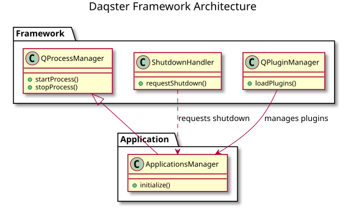
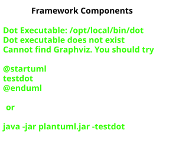
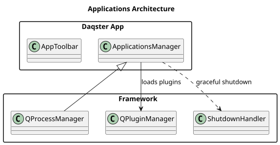
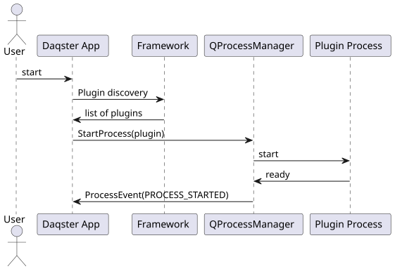
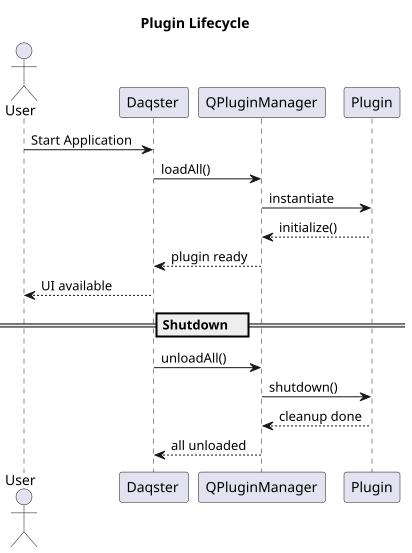

[Български](./INDEX.md) | [English](./INDEX.en.md)

# Индекс на документацията

Това е главната навигационна страница. Тук стоят само най-горните входни точки.

## Основни входни точки

- [Project README](../README.md) - общ преглед на проекта, инструкции за build и структура
- [Architecture](./Architecture/README.md) - архитектурен хъб и връзки към подсистемите
- [Development Topics](./development/README.md) - разработка, дебъг и workflow за contributors
- [Operations Topics](./operations/README.md) - build, поддръжка и operational теми
- [Porting Topics](./porting/README.md) - пренасяне и съвместимост между версии

## Диаграми

Визуални преглади на архитектурата и процесите (PlantUML източници и генерирани SVG):

### Архитектура

#### Architecture Diagram — обща система архитектура

[Източник: architecture.puml](./diagrams/architecture.puml)

#### Framework Components — framework слојеви и класи

[Източник: framework_components.puml](./diagrams/framework_components.puml)

#### Applications Manager — приложение слој

[Източник: apps_architecture.puml](./diagrams/apps_architecture.puml)

### Процеси

#### Startup Sequence — инициализация на Daqster

[Източник: startup_sequence.puml](./diagrams/startup_sequence.puml)

#### Plugin Lifecycle — жизнен цикъл на плъгини

[Източник: plugin_lifecycle.puml](./diagrams/plugin_lifecycle.puml)

### Документация

#### Documentation Hierarchy — структура на Docs/ папката

[PlantUML източник](./diagrams/documentation_hierarchy.puml)
