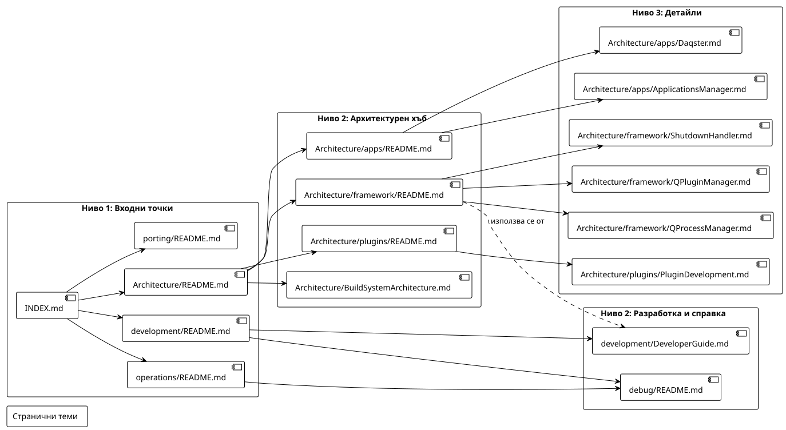

[Български](./index.md) | [English](./index.en.md)

# Индекс на документацията

Това е главната навигационна страница. Тук стоят само най-горните входни точки.

## Основни входни точки

- [Project README](../README.md) - общ преглед на проекта, инструкции за build и структура
- [Architecture](./Architecture/README.md) - архитектурен хъб и връзки към подсистемите
- [Development Topics](./development/README.md) - разработка, дебъг и workflow за contributors
- [Operations Topics](./operations/README.md) - build, поддръжка и operational теми
- [Porting Topics](./porting/README.md) - пренасяне и съвместимост между версии

## Диаграми

Архитектурните и процесните диаграми са в архитектурния хъб:
- [Architecture](./Architecture/README.md)

### Документация

#### Documentation Hierarchy — структура на Docs/ папката

[PlantUML източник](./diagrams/documentation_hierarchy.puml)
