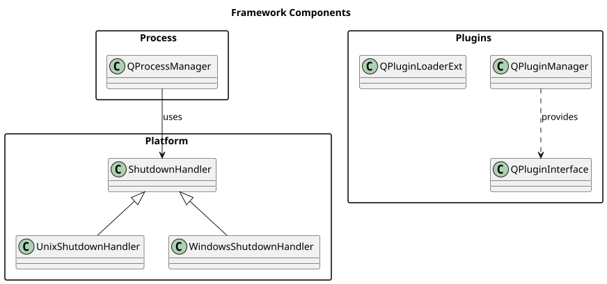

[Български](./BuildSystemArchitecture.md) | [English](./BuildSystemArchitecture.en.md)

Parent: [Architecture Overview](./README.en.md) | [Documentation Index](../index.en.md)

# Daqster Build System Architecture

## Overview

Daqster's build system is based on CMake template functions that automatically manage dependencies and conditional compilation of components (applications, plugins, libraries) based on available Qt modules, external libraries, and packages.

### Key Features (v2.2)

- **Declarative syntax**: Everything is in the `create_plugin()` call
- **Automatic dependency checking**: Verified before compilation
- **Early return**: Components with missing dependencies are not created
- **Elegant parameters**: `INCLUDE_DIRECTORIES`, `COMPILE_DEFINITIONS`, `LINK_LIBRARIES`, `INSTALL_RPATH`
- **Qt5/Qt6 compatibility**: Automatically adapts to the Qt version
- **Self-contained components**: Each component declares its own dependencies
- **No CMake errors**: Target commands are only called for enabled components

## Key Principles

### 1. Template-Based Component Creation
Each component type (app, plugin, library) is created through a specialized template function that:
- Automatically checks dependencies
- Automatically links required libraries
- Sets up the correct include directories
- Configures install rules
- Manages RPATH for runtime linking

### 2. Self-Contained Components
Each component declares its dependencies in its own `CMakeLists.txt` file, with no need for centralized registration.

### 3. Dynamic Qt Module Discovery
Qt modules are discovered dynamically only when needed by a component, rather than searching for all possible modules upfront.

## Component Templates

### 1. Applications - `create_application()`
```cmake
create_application(Daqster
    SOURCES
        main.cpp
        ApplicationsManager.cpp
        AppToolbar.cpp
        # ... other files
    REQUIRES_LIBRARIES
        Qt${QT_VERSION_MAJOR}::Core
        Qt${QT_VERSION_MAJOR}::Widgets
        Qt${QT_VERSION_MAJOR}::Gui
        frame_work
)
```

**Features:**
- Creates an executable
- Automatically links dependencies
- Installs to `bin/`
- Proper RPATH for library discovery

### 2. Plugins - `create_plugin()`
```cmake
create_plugin(QtCoinTraderPlugin
    SOURCES
        QtCoinTraderInterface.cpp
        QtCoinTraderPluginObject.cpp
        utils/RandData.cpp
        # ... other files
    REQUIRES_LIBRARIES
        Qt${QT_VERSION_MAJOR}::Core
        Qt${QT_VERSION_MAJOR}::Gui
        Qt${QT_VERSION_MAJOR}::Qml
        Qt${QT_VERSION_MAJOR}::Network
        Qt${QT_VERSION_MAJOR}::WebSockets
        qtrest_lib
        OpenSSL::SSL
        OpenSSL::Crypto
        frame_work
    INCLUDE_DIRECTORIES  # Optional
        ../../external_libs/nodeeditor/include
        ./Audio
        ./Library
    COMPILE_DEFINITIONS  # Optional
        NODE_EDITOR_SHARED
        CUSTOM_FEATURE_ENABLED
    LINK_LIBRARIES      # Optional
        additional_lib
    INSTALL_RPATH       # Optional
        "$ORIGIN/../../lib"
)
```

**Features:**
- Creates a shared library
- Automatically adds `BUILD_AVAILABLE_PLUGIN` definition
- Standard include directories for plugins (`./`, `../../../frame_work/base/src/include`)
- **Additional include directories** via `INCLUDE_DIRECTORIES` parameter
- **Additional compile definitions** via `COMPILE_DEFINITIONS` parameter
- **Additional libraries** via `LINK_LIBRARIES` parameter
- Installs to `bin/` for runtime plugin discovery
- **Custom RPATH** via `INSTALL_RPATH` parameter (default: `$ORIGIN/../../lib`)
- **All additional settings are applied automatically only if dependencies are available**

### 3. Internal Libraries - `create_internal_library()`
```cmake
create_internal_library(frame_work
    SOURCES
        base/src/QPluginManager.cpp
        base/src/QPluginInterface.cpp
        base/src/QPluginLoaderExt.cpp
        # ... other files
    REQUIRES_LIBRARIES
        Qt${QT_VERSION_MAJOR}::Core
        Qt${QT_VERSION_MAJOR}::Widgets
)
```

**Features:**
- Creates a shared library for internal use
- Automatically links dependencies
- Installs to `lib/`
- Export definitions via `FRAME_WORKSHARED_EXPORT`

### 4. External Libraries - `create_external_library()`

External libraries are added via `create_external_library()`, which automatically:
- Initializes the git submodule if the directory is missing (when `DAQSTER_AUTO_INIT_SUBMODULES=ON`)
- Calls `add_subdirectory()`
- Registers the library as an available dependency
- Adds a copy wrapper target to copy artifacts into `build/lib/`

```cmake
# In root CMakeLists.txt
# NodeEditor remains Qt5-only
if(QT_VERSION_MAJOR EQUAL 5)
    create_external_library(nodeeditor)   # target: QtNodes
endif()

# QtRest is Qt5/Qt6 compatible
create_external_library(qtrest_lib)       # target: qtrest_lib
```

**Note:** The parameter to `create_external_library()` is the directory name under `src/plugins/external_libs/`, but the actual CMake target may differ (e.g., `nodeeditor` -> target `QtNodes`).

**Meta-target:**
```bash
cmake --build . --target daqster_build_externals  # builds all external libs
```

**CMake options:**
```cmake
# Automatically initialize submodule if directory is missing (default: ON)
-DDAQSTER_AUTO_INIT_SUBMODULES=ON

# Show detailed dependency checks (default: OFF)
-DDAQSTER_VERBOSE_DEPENDENCIES=ON
```

## Dependency Management

### Automatic Dependency Checking

The `check_component_dependencies()` function automatically:

1. **For Qt modules** (`Qt5::Core`, `Qt6::Widgets`, etc.):
   - Extracts the module name (e.g., `Core` from `Qt5::Core`)
   - Dynamically calls `find_package(Qt${QT_VERSION_MAJOR}${MODULE_NAME} QUIET)`
   - Checks whether the target exists
   
   ```cmake
   # Example: Qt5::Charts
   string(REGEX REPLACE "^Qt[0-9]+::" "" MODULE_NAME ${LIBRARY})
   # MODULE_NAME = "Charts"
   find_package(Qt${QT_VERSION_MAJOR}Charts QUIET)
   if(TARGET Qt5::Charts)
       # Module is available
   endif()
   ```

2. **For external libraries** (`nodes`, `qtrest_lib`):
   - Checks whether the target exists
   - Checks global property `EXTERNAL_LIB_${LIBRARY}_AVAILABLE`
   
   ```cmake
   if(TARGET nodes)
       # Library is available
   elseif(EXTERNAL_LIB_nodes_AVAILABLE)
       # Library is registered as available
   endif()
   ```

3. **For packages** (`OpenSSL::SSL`, `OpenSSL::Crypto`):
   - Checks whether the target exists
   
   ```cmake
   if(TARGET OpenSSL::SSL)
       # Package is available
   endif()
   ```

### Automatic Linking

The `link_component_dependencies()` function:
- Links all libraries from the `REQUIRES_LIBRARIES` list
- Automatically provides include directories via target properties
- No need for manual `target_link_libraries()` calls

```cmake
# Called automatically inside create_plugin(), create_application(), etc.
link_component_dependencies(${COMPONENT_NAME})

# Under the hood it does:
foreach(LIBRARY ${COMPONENT_LIBRARIES})
    if(TARGET ${LIBRARY})
        target_link_libraries(${COMPONENT_NAME} ${LIBRARY})
    endif()
endforeach()
```

### Conditional Component Exclusion

**Important:** The dependency check runs **BEFORE** `add_library()`/`add_executable()`. If dependencies are missing, the template function exits early with `return()` and the component is **never created**.

```cmake
# Inside create_plugin():
# 1. First, dependencies are checked
register_component(${COMPONENT_NAME}
    REQUIRES_LIBRARIES ${PLUGIN_REQUIRES_LIBRARIES}
)

# 2. Check whether the component is enabled
get_property(COMPONENT_ENABLED GLOBAL PROPERTY COMPONENT_${COMPONENT_NAME}_ENABLED)

if(NOT COMPONENT_ENABLED)
    # Show reasons and exit
    message(STATUS "Skipping plugin ${COMPONENT_NAME} - dependencies not met:")
    foreach(REASON ${REASONS})
        message(STATUS "  - ${REASON}")
    endforeach()
    return()  # add_library() is NOT called!
endif()

# 3. ONLY if dependencies are OK, create the target
add_library(${COMPONENT_NAME} SHARED ${PLUGIN_SOURCES})
```

**Example output:**

```cmake
# If WebSockets is missing:
-- Checking Qt5::WebSockets - target exists: FALSE
-- QtCoinTraderPlugin plugin: DISABLED
--   - Qt5::WebSockets not available
-- Skipping plugin QtCoinTraderPlugin - dependencies not met:
--   - Qt5::WebSockets not available

# add_library(QtCoinTraderPlugin ...) is NOT called
# target_include_directories(QtCoinTraderPlugin ...) is NOT called
# No CMake errors for missing targets
```

**Advantages:**
- No attempts to compile components with missing dependencies
- No CMake errors for missing targets
- Clean and clear output for disabled components
- Additional settings (INCLUDE_DIRECTORIES, COMPILE_DEFINITIONS) only apply if the component is enabled

## Build System Flow



[PlantUML source](../diagrams/framework_components.puml)

## Plugin Component Architecture


[PlantUML source](../diagrams/plugin_components.puml)

## Build System

### CMake Configuration
- **Minimum version:** 3.16
- **Qt version:** 5.15.2
- **Build types:** Debug, Release
- **Install targets:** bin, lib, plugins

### AppImage Creation
- **Unified script:** `tools/create_appimage.sh`
- **Local mode:** Uses the local Qt installation
- **CI mode:** Uses system Qt libraries
- **Output:** `Daqster-x86_64.AppImage`

## Qt Version Detection

### FindQtVersion.cmake

The module automatically:
- Detects the Qt version from `CMAKE_PREFIX_PATH` or the `USE_QT6` option
- Sets `QT_VERSION_MAJOR` and `QT_PREFIX` variables
- Finds core Qt modules (`Core`, `Gui`, `Widgets`)
- Allows using `Qt${QT_VERSION_MAJOR}::Module` in dependencies

**Detection Logic:**
```cmake
# 1. Check USE_QT6 flag
if(DEFINED USE_QT6)
    if(USE_QT6)
        set(QT_PREFER_QT6 TRUE)
    else()
        set(QT_PREFER_QT5 TRUE)
    endif()
# 2. Check CMAKE_PREFIX_PATH
elseif(CMAKE_PREFIX_PATH MATCHES "qt/5\\.")
    set(QT_PREFER_QT5 TRUE)
elseif(CMAKE_PREFIX_PATH MATCHES "qt/6\\.")
    set(QT_PREFER_QT6 TRUE)
endif()

# 3. Find Qt version
if(QT_PREFER_QT5)
    find_package(Qt5 REQUIRED COMPONENTS Core Widgets Gui)
    set(QT_VERSION_MAJOR 5)
else()
    find_package(Qt6 REQUIRED COMPONENTS Core Widgets Gui)
    set(QT_VERSION_MAJOR 6)
endif()
```

**Usage Example:**
```cmake
# Works automatically for both Qt5 and Qt6
REQUIRES_LIBRARIES
    Qt${QT_VERSION_MAJOR}::Core
    Qt${QT_VERSION_MAJOR}::Widgets
    Qt${QT_VERSION_MAJOR}::Qml
```

## File Structure

```
Daqster/
├── CMakeLists.txt              # Root build file
├── cmake/
│   ├── FindQtVersion.cmake     # Qt version detection
│   ├── ComponentTemplates.cmake # Template functions (create_plugin, create_app, etc.)
│   └── PluginDependencyManager.cmake # Dependency checking functions
├── src/
│   ├── frame_work/
│   │   └── CMakeLists.txt      # Internal library (uses create_internal_library)
│   ├── plugins/
│   │   ├── external_libs/      # Git submodules (nodeeditor, qtrest_lib)
│   │   │   ├── nodeeditor/
│   │   │   │   └── CMakeLists.txt  # External library (own build system)
│   │   │   └── qtrest_lib/
│   │   │       └── CMakeLists.txt  # External library (own build system)
│   │   ├── node_editor_widget/ # Shared GUI component
│   │   │   └── CMakeLists.txt  # SHARED library
│   │   ├── node_editor_app/    # Basic app plugin
│   │   │   └── CMakeLists.txt  # Plugin (uses create_plugin)
│   │   ├── QtCoinTrader/
│   │   │   └── CMakeLists.txt  # Plugin (uses create_plugin)
│   │   └── tests/
│   │       ├── plugin_main_test/
│   │       │   └── CMakeLists.txt # Test plugin (uses create_plugin)
│   │       ├── plugin_fancy_test/
│   │       ├── plugin_uggly_test/
│   │       └── template_plugin_daqster/
│   └── apps/
│       └── Daqster/
│           └── CMakeLists.txt  # Application (uses create_application)
```

## Build Order

```cmake
# Root CMakeLists.txt

# 1. Include build system modules
include(FindQtVersion)
include(PluginDependencyManager)
include(ComponentTemplates)

# 2. Core framework (no external dependencies)
add_subdirectory(src/frame_work)

# 3. External libraries
# NodeEditor is Qt5-only
if(QT_VERSION_MAJOR EQUAL 5)
    create_external_library(nodeeditor)   # -> target: QtNodes
endif()

# QtRest works on Qt5/Qt6
create_external_library(qtrest_lib)       # -> target: qtrest_lib

# 4. Shared components
add_subdirectory(src/plugins/libs/node_editor_widget)  # SHARED library

# 5. Plugins — all are added; the dependency system excludes them automatically
add_subdirectory(src/plugins/node_editor_app)     # Qt5-only (requires QtNodes + widget)
add_subdirectory(src/plugins/QtCoinTrader)       # Qt5-only (requires qtrest_lib)
add_subdirectory(src/plugins/tests/plugin_main_test)
add_subdirectory(src/plugins/tests/plugin_fancy_test)
add_subdirectory(src/plugins/tests/plugin_uggly_test)
add_subdirectory(src/plugins/tests/template_plugin_daqster)

# 5. Applications
add_subdirectory(src/apps/Daqster)

# 6. Build summary
print_build_configuration_summary()
```

## Conditional Building

### Qt Version Based

All plugin `add_subdirectory()` calls are always made. The dependency system automatically excludes them if the required external libs are missing:

```
Qt5 build:  NodeEditorPlugin enabled, QtCoinTraderPlugin enabled, test plugins enabled
Qt6 build:  NodeEditorPlugin disabled, QtCoinTraderPlugin enabled, test plugins enabled
```

> Qt6 limitation: `NodeEditorPlugin` does not compile with Qt6 (`nodeeditor` is still Qt5-only). `QtCoinTraderPlugin` compiles on Qt6 because `qtrest_lib` is now ported to Qt6.

### Dependency Based (Automatic)
A component is excluded automatically if its dependencies are missing:

```cmake
# Plugin with OpenSSL dependency
create_plugin(QtCoinTraderPlugin
    SOURCES ...
    REQUIRES_LIBRARIES
        OpenSSL::SSL      # Automatically checked
        OpenSSL::Crypto   # Automatically checked
        qtrest_lib        # Automatically checked
        frame_work
)

# If OpenSSL is missing:
# -- Checking OpenSSL::SSL - target exists: FALSE
# -- QtCoinTraderPlugin plugin: DISABLED
# --   - OpenSSL::SSL not available
```

## Plugin Discovery at Runtime

### Plugin Search Paths

`QPluginManager` searches for plugins in the following directories (by priority):

1. **Build directory** (highest priority for development):
   - `{applicationDirPath}`
   - `{applicationDirPath}/plugins`
   
2. **Install directory**:
   - `{applicationDirPath}/../lib/daqster/plugins`
   
3. **Environment variables**:
   - `DAQSTER_PLUGIN_DIR`
   - `DAQSTER_PLUGIN_PATH` (multiple paths separated by `:`)
   
4. **User directory**:
   - `~/.local/share/daqster/plugins`
   
5. **System directories** (lowest priority):
   - `/usr/lib/daqster/plugins`
   - `/usr/local/lib/daqster/plugins`

### Configuration

Plugin search paths are configured in `QPluginManager.cpp`:

```cpp
// Build directory (highest priority for debug)
m_DirList.append(qApp->applicationDirPath());  // Searches in the bin/ directory
m_DirList.append(qApp->applicationDirPath()+QString("/plugins"));
m_DirList.append(QDir(qApp->applicationDirPath()+"/../lib/daqster/plugins").absolutePath());

// Environment variable override
const QString envDir = qgetenv("DAQSTER_PLUGIN_DIR");
if (!envDir.isEmpty()) {
    m_DirList.append(envDir);
}

// User plugins directory
QString userPluginDir = QDir::homePath() + "/.local/share/daqster/plugins";
m_DirList.append(userPluginDir);
```

## Examples

### Adding a New Plugin

1. Create directory: `src/plugins/MyNewPlugin/`

2. Create `CMakeLists.txt`:
```cmake
create_plugin(MyNewPlugin
    SOURCES
        MyPluginInterface.cpp
        MyPluginObject.cpp
        MyPluginInterface.h
        MyPluginObject.h
        resources.qrc
    REQUIRES_LIBRARIES
        Qt${QT_VERSION_MAJOR}::Core
        Qt${QT_VERSION_MAJOR}::Gui
        frame_work
)
```

3. Add to root `CMakeLists.txt`:
```cmake
# Plugins section
add_subdirectory(src/plugins/MyNewPlugin)
```

4. Build:
```bash
cmake --build build --target MyNewPlugin
```

### Adding a Plugin with External Dependencies and Custom Settings

```cmake
create_plugin(AdvancedPlugin
    SOURCES
        AdvancedInterface.cpp
        AdvancedObject.cpp
        utils/Helper.cpp
    REQUIRES_LIBRARIES
        Qt${QT_VERSION_MAJOR}::Core
        Qt${QT_VERSION_MAJOR}::Gui
        Qt${QT_VERSION_MAJOR}::Network
        Qt${QT_VERSION_MAJOR}::Charts
        nodes              # External library
        OpenSSL::SSL       # System package
        frame_work
    INCLUDE_DIRECTORIES
        ../../external_libs/nodes/include
        ./utils
        ./models
    COMPILE_DEFINITIONS
        ADVANCED_PLUGIN_VERSION="1.0.0"
        ENABLE_ADVANCED_FEATURES
    LINK_LIBRARIES
        custom_helper_lib
    INSTALL_RPATH
        "$ORIGIN/../../lib:$ORIGIN/../custom"
)

# All additional settings (INCLUDE_DIRECTORIES, COMPILE_DEFINITIONS, etc.)
# are applied automatically ONLY if dependencies are available.
# If nodes or OpenSSL are missing, the plugin is excluded and no target
# commands are called (no CMake errors).
```

### Adding an External Library

1. Place the library in `src/plugins/external_libs/mylibrary/`

2. In root `CMakeLists.txt`:
```cmake
# External libraries section
create_external_library(mylibrary)  # automatically registers dependency
```

3. Use in a plugin:
```cmake
create_plugin(MyPlugin
    SOURCES ...
    REQUIRES_LIBRARIES
        mylibrary  # Automatically checked
        frame_work
)
```

### Adding a New Application

1. Create directory: `src/apps/MyApp/`

2. Create `CMakeLists.txt`:
```cmake
create_application(MyApp
    SOURCES
        main.cpp
        MainWindow.cpp
        MainWindow.h
        mainwindow.ui
        resources.qrc
    REQUIRES_LIBRARIES
        Qt${QT_VERSION_MAJOR}::Core
        Qt${QT_VERSION_MAJOR}::Widgets
        frame_work
)

# Additional include directories if needed
target_include_directories(MyApp PRIVATE ./)
```

3. Add to root `CMakeLists.txt`:
```cmake
# Apps section
add_subdirectory(src/apps/MyApp)
```

## CMake Functions Reference

### Component Templates (ComponentTemplates.cmake)

#### `create_application(COMPONENT_NAME SOURCES ... REQUIRES_LIBRARIES ...)`
Creates an executable application.

**Parameters:**
- `COMPONENT_NAME` - Application name
- `SOURCES` - List of source files
- `REQUIRES_LIBRARIES` - List of dependencies

**Example:**
```cmake
create_application(Daqster
    SOURCES main.cpp MainWindow.cpp
    REQUIRES_LIBRARIES Qt5::Core Qt5::Widgets frame_work
)
```

#### `create_plugin(COMPONENT_NAME SOURCES ... REQUIRES_LIBRARIES ...)`
Creates a plugin shared library.

**Parameters:**
- `COMPONENT_NAME` - Plugin name
- `SOURCES` - List of source files
- `REQUIRES_LIBRARIES` - List of dependencies

**Automatic Features:**
- Adds `BUILD_AVAILABLE_PLUGIN` definition
- Configures standard include directories
- Configures RPATH for runtime linking

**Example:**
```cmake
create_plugin(NodeEditorApp
    SOURCES NodeEditorInterface.cpp NodeEditorObject.cpp
    REQUIRES_LIBRARIES Qt5::Core Qt5::Gui QtNodes node_editor_widget frame_work
)
```

#### `create_internal_library(COMPONENT_NAME SOURCES ... REQUIRES_LIBRARIES ...)`
Creates an internal shared library.

**Parameters:**
- `COMPONENT_NAME` - Library name
- `SOURCES` - List of source files
- `REQUIRES_LIBRARIES` - List of dependencies

**Example:**
```cmake
create_internal_library(frame_work
    SOURCES QPluginManager.cpp QPluginInterface.cpp
    REQUIRES_LIBRARIES Qt5::Core Qt5::Widgets
)
```

### Dependency Management (PluginDependencyManager.cmake)

#### `register_component(COMPONENT_NAME REQUIRES_LIBRARIES ...)`
Registers a component and checks its dependencies.

**Internal Function** — called automatically by template functions.

#### `check_plugin_dependencies(COMPONENT_NAME REQUIRES_LIBRARIES ...)`
Checks whether all dependencies are available.

**Returns:**
- `${COMPONENT_NAME}_ENABLED` - TRUE/FALSE
- `${COMPONENT_NAME}_REASONS` - List of reasons if DISABLED

#### `link_component_dependencies(COMPONENT_NAME)`
Automatically links all dependencies of a component.

**Internal Function** — called automatically by template functions.

#### `create_external_library(COMPONENT_NAME)`
Adds an external library (submodule), registers it, and sets up a copy target.

**Example:**
```cmake
create_external_library(nodeeditor)  # adds src/plugins/external_libs/nodeeditor
create_external_library(qtrest_lib)  # adds src/plugins/external_libs/qtrest_lib
```

#### `register_external_library_dependency(LIBRARY_NAME)`
Low-level function — registers a target as an available external dependency. Called automatically by `create_external_library()`.

#### `verbose_status(...)`
Outputs a STATUS message only if `DAQSTER_VERBOSE_DEPENDENCIES=ON`.

#### `print_component_status_summary()`
Shows the status of all registered components.

#### `print_build_configuration_summary()`
Shows general information about the build configuration.

## Build System Variables

### CMake Options (command line)

| Option | Default | Description |
|---|---|---|
| `USE_QT6` | — | `ON` for Qt6, `OFF` for Qt5; if not set — auto-detect from `CMAKE_PREFIX_PATH` |
| `DAQSTER_VERBOSE_DEPENDENCIES` | `OFF` | Show detailed dependency checks during configure |
| `DAQSTER_AUTO_INIT_SUBMODULES` | `ON` | Automatically run `git submodule update --init` when external directory is missing |

**Example:**
```bash
cmake -S . -B build \
  -DUSE_QT6=OFF \
  -DDAQSTER_VERBOSE_DEPENDENCIES=ON \
  -DCMAKE_PREFIX_PATH=/path/to/Qt/5.15.2/gcc_64
```

### Global Variables

- `QT_VERSION_MAJOR` - Major Qt version (5 or 6)
- `QT_PREFIX` - Prefix for Qt targets (`Qt5` or `Qt6`)
- `QT_VERSION` - Full Qt version string (e.g., `5.15.2`)

### Component Properties

For each component, the following global properties are created:

- `COMPONENT_${NAME}_ENABLED` - Whether the component is enabled
- `COMPONENT_${NAME}_REASONS` - Reasons for disable (if any)
- `COMPONENT_${NAME}_LIBRARIES` - List of dependencies

### External Library Properties

- `EXTERNAL_LIB_${NAME}_AVAILABLE` - Whether the external library is available

## Benefits

1. **Simplified structure**
   - Each component is self-contained
   - Minimal boilerplate code
   - Clear and consistent structure

2. **Automatic dependency management**
   - No manual linking required
   - Automatic availability checking
   - Conditional component exclusion

3. **Qt5/Qt6 portability**
   - Unified syntax for both versions
   - Automatic version detection
   - Dynamic module discovery

4. **Easy to extend**
   - Adding a new plugin — 1 file
   - Adding an external library — 2 lines
   - Clear template functions

5. **Build-time optimization**
   - Only needed modules are searched
   - Conditional compilation
   - Fast CMake configuration

6. **Clear architecture**
   - Template-based approach
   - Separation of concerns
   - Self-documenting code

## Troubleshooting

### Plugin not found at runtime

**Symptom:**
```
PluginsList count: 0
```

**Cause:** Plugin search paths do not include the build directory

**Solution:** Check `QPluginManager.cpp`:
```cpp
m_DirList.append(qApp->applicationDirPath());  // Must be first
```

### Dependency not found at build time

**Symptom:**
```
-- Checking Qt5::Charts - target exists: FALSE
-- QtCoinTraderPlugin plugin: DISABLED
--   - Qt5::Charts not available
```

**Cause:** Qt module is not installed or not found

**Solution:**
1. Install the missing Qt module
2. Or remove the dependency from `REQUIRES_LIBRARIES`
3. Or make the dependency conditional:
```cmake
if(Qt${QT_VERSION_MAJOR}Charts_FOUND)
    target_link_libraries(MyPlugin Qt${QT_VERSION_MAJOR}::Charts)
    target_compile_definitions(MyPlugin PRIVATE CHARTS_AVAILABLE)
endif()
```

### External library not found

**Symptom:**
```
-- Checking nodes - target exists: FALSE
-- NodeEditorPlugin plugin: DISABLED
--   - nodes not available
```

**Cause:** External library is not registered

**Solution:** Add via `create_external_library()`:
```cmake
create_external_library(nodeeditor)
# Automatically registers dependency
```

### Qt version detection error

**Symptom:**
```
CMake Error: Could not find Qt5 or Qt6
```

**Cause:** `CMAKE_PREFIX_PATH` does not point to Qt

**Solution:**
```bash
# Set CMAKE_PREFIX_PATH
cmake -DCMAKE_PREFIX_PATH=/path/to/Qt/5.15.2/gcc_64 ..

# Or use the USE_QT6 flag
cmake -DUSE_QT6=OFF ..  # For Qt5
cmake -DUSE_QT6=ON ..   # For Qt6
```

### MOC errors at build time

**Symptom:**
```
fatal error: QObject: No such file or directory
```

**Cause:** Missing include directories

**Solution:** Template functions automatically add include directories, but if you have custom includes:
```cmake
create_plugin(MyPlugin
    SOURCES ...
    REQUIRES_LIBRARIES Qt${QT_VERSION_MAJOR}::Core
)

# Additional includes
target_include_directories(MyPlugin PRIVATE 
    ./my_include_dir
    ../../some_other_dir
)
```

### RPATH errors at runtime

**Symptom:**
```
error while loading shared libraries: libframe_work.so: cannot open shared object file
```

**Cause:** RPATH is not configured correctly

**Solution:** Template functions configure RPATH automatically, but verify:
```cmake
# For plugins
set_target_properties(${COMPONENT_NAME} PROPERTIES
    INSTALL_RPATH "$ORIGIN/../../lib"
)

# For applications
set_target_properties(${COMPONENT_NAME} PROPERTIES
    INSTALL_RPATH "$ORIGIN/../lib"
)
```

## Best Practices

1. **Use `Qt${QT_VERSION_MAJOR}::` for all Qt dependencies**
   ```cmake
   # Good
   REQUIRES_LIBRARIES Qt${QT_VERSION_MAJOR}::Core
   
   # Bad
   REQUIRES_LIBRARIES Qt5::Core  # Hardcoded version
   ```

2. **Declare all dependencies explicitly**
   ```cmake
   # Good — all dependencies are visible
   REQUIRES_LIBRARIES
       Qt${QT_VERSION_MAJOR}::Core
       Qt${QT_VERSION_MAJOR}::Gui
       Qt${QT_VERSION_MAJOR}::Network
       frame_work
   
   # Bad — hidden dependencies
   REQUIRES_LIBRARIES frame_work
   # And then manually:
   target_link_libraries(MyPlugin Qt5::Network)
   ```

3. **Register external libraries via create_external_library**
    ```cmake
    # Good
    create_external_library(mylibrary)
    
    # Bad (old way)
    add_subdirectory(src/external_libs/mylibrary)
    register_external_library_dependency(mylibrary)
    ```

4. **Use template functions, not manual CMake code**
   ```cmake
   # Good
   create_plugin(MyPlugin
       SOURCES ...
       REQUIRES_LIBRARIES ...
   )
   
   # Bad
   add_library(MyPlugin SHARED ...)
   target_link_libraries(MyPlugin ...)
   install(TARGETS MyPlugin ...)
   # ... lots of manual code
   ```

5. **Group related components**
   ```cmake
    # Root CMakeLists.txt — clear structure
    
    # Framework
    add_subdirectory(src/frame_work)
    
    # External libraries
    if(QT_VERSION_MAJOR EQUAL 5)
        create_external_library(nodeeditor)
    endif()
    create_external_library(qtrest_lib)
    
    # Shared components
    add_subdirectory(src/plugins/libs/node_editor_widget)
    
    # Plugins
    add_subdirectory(src/plugins/node_editor_app)
    add_subdirectory(src/plugins/QtCoinTrader)
    
    # Applications
    add_subdirectory(src/apps/Daqster)
   ```

## Migration Guide

### From the old system to the new

#### Before (PluginDependencyManager style):
```cmake
# src/plugins/CMakeLists.txt
register_plugin(MyPlugin
    REQUIRES_QT_MODULES Core Gui Network
    REQUIRES_EXTERNAL_LIBS mylibrary
)
add_plugin_subdirectory(MyPlugin my_plugin)

# src/plugins/my_plugin/CMakeLists.txt
add_library(MyPlugin SHARED ...)
link_plugin_dependencies(MyPlugin)
target_link_libraries(MyPlugin Qt5::Network)
install(TARGETS MyPlugin ...)
```

#### After (Template-based style):
```cmake
# src/plugins/my_plugin/CMakeLists.txt
create_plugin(MyPlugin
    SOURCES
        MyInterface.cpp
        MyObject.cpp
    REQUIRES_LIBRARIES
        Qt${QT_VERSION_MAJOR}::Core
        Qt${QT_VERSION_MAJOR}::Gui
        Qt${QT_VERSION_MAJOR}::Network
        mylibrary
        frame_work
)

# Root CMakeLists.txt
add_subdirectory(src/plugins/my_plugin)
```

**Key changes:**
1. Removed centralized `src/plugins/CMakeLists.txt`
2. Each plugin is self-contained in its own directory
3. Use `create_plugin()` instead of manual CMake code
4. Dependencies are in a single `REQUIRES_LIBRARIES` list
5. Automatic linking — no need for `link_plugin_dependencies()`

## Best Practices Summary

### Use the new parameters of create_plugin()

**Good:** Everything is declared in the `create_plugin()` call
```cmake
create_plugin(NodeEditorApp
    SOURCES ...
    REQUIRES_LIBRARIES ...
    INCLUDE_DIRECTORIES
        ./Audio
    COMPILE_DEFINITIONS
        NODE_EDITOR_SHARED
)
```

**Bad:** Manual checks and target commands outside the template function
```cmake
create_plugin(NodeEditorPlugin
    SOURCES ...
    REQUIRES_LIBRARIES ...
)

# Bad — manual check and target commands
get_property(COMPONENT_ENABLED GLOBAL PROPERTY COMPONENT_NodeEditorPlugin_ENABLED)
if(COMPONENT_ENABLED)
    target_include_directories(NodeEditorPlugin ...)
    target_compile_definitions(NodeEditorPlugin ...)
endif()
```

### Advantages of the new approach

1. **Clean declarative syntax** — everything in one place
2. **Automatic management** — the template function handles everything
3. **No errors for missing targets** — additional settings only apply if the component is enabled
4. **Easier to maintain** — clear and concise

### Dependency Checking Flow

```
create_plugin(MyPlugin ...)
    ↓
register_component(MyPlugin) - checks dependencies
    ↓
get_property(COMPONENT_ENABLED)
    ↓
if (NOT ENABLED) -> return()  <- add_library() is NOT called!
    ↓
if (ENABLED) -> add_library(MyPlugin ...)
             -> target_include_directories() (if INCLUDE_DIRECTORIES is set)
             -> target_compile_definitions() (if COMPILE_DEFINITIONS is set)
             -> target_link_libraries() (automatic + LINK_LIBRARIES)
             -> install()
             -> set_target_properties()
```

## Version History

### Version 2.2 (Current - July 2026)
- **Directory restructuring**: `src/external_libs/` → `src/plugins/external_libs/`
- **NodeEditor split**: Monolithic `node_editor` plugin → `node_editor_widget` (SHARED) + `node_editor_app` (plugin)
- **nodeeditor target**: Changed from `nodes` to `QtNodes` (pin commit `4709573`)
- **CI improvements**: qtrest install fix, Python patching of cmake_install.cmake

### Version 2.1 (October 2025)
- **Elegant template parameters**: `INCLUDE_DIRECTORIES`, `COMPILE_DEFINITIONS`, `LINK_LIBRARIES`, `INSTALL_RPATH`
- **Early return on missing dependencies**: No attempts to create targets with unmet dependencies
- **Automatic settings application**: Additional target commands only called if component is enabled
- **Removed manual checks**: No need for `get_property(COMPONENT_ENABLED)` in plugin CMakeLists.txt
- **Improved error messages**: Clear messages for disabled components with reasons

### Version 2.0 (2024)
- Template-based component creation
- Self-contained components
- Dynamic Qt module discovery
- Simplified architecture
- Removed centralized plugin registration

### Version 1.0 (Legacy)
- Centralized plugin registration
- Separate dependency types (QT_MODULES, EXTERNAL_LIBS, PACKAGES)
- Manual linking with `link_plugin_dependencies()`
- Pre-discovery of all Qt modules

## See Also

- `cmake/ComponentTemplates.cmake` - Template function implementations
- `cmake/PluginDependencyManager.cmake` - Dependency checking logic
- `cmake/FindQtVersion.cmake` - Qt version detection
- `src/frame_work/base/src/include/plugin_global.h` - Plugin export macros
